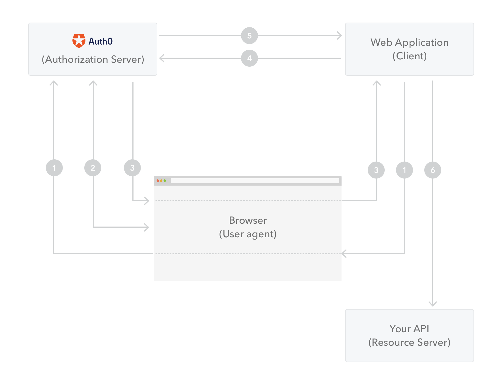

---

**TL;DR**: The Swift language is growing in popularity not only for iOS apps, but also for server-side applications. In this article, we'll use Vapor and Droplet to build a web app.

---

> Note: This tutorial was written using Vapor 1.5

Since it was introduced in mid-2014, Swift language has seen [stunning growth in popularity](http://redmonk.com/sogrady/2016/07/20/language-rankings-6-16/). When the language became [open source](https://developer.apple.com/swift/blog/?id=34) and available on Linux in late-2015, server-side applications started to gain popularity as well.

People involved with [IBM Kitura](https://github.com/IBM-Swift/Kitura), [Vapor](https://github.com/vapor/vapor), [Zewo](https://github.com/Zewo/Zewo) and [Perfect](https://github.com/PerfectlySoft/Perfect) - the hottest Swift server-side frameworks - were invited by Apple to focus on server-side needs like networking, security and HTTP/WebSocket parsing. This way, they will work to make possible to write pure Swift server-side frameworks, without needing to rely on C libraries.

In this tutorial, we'll learn how to set up Vapor framework, learn its essential concepts, and build a simple web application for creating and retrieving contacts.

## Swift Server Side Prerequisites

You need a machine running Mac OS X 10.11+ or Linux. Apple builds and tests binaries for Ubuntu 14.04 and 16.04 and 16.10, but it's possible to build the language from source in other Linux distributions. You can download the binaries [here](https://swift.org/download/).

## Setting up Swift and Vapor

First of all, we need to [download and install Swift 3](https://swift.org/download/) (the steps are different for Ubuntu and macOS). After that, it's necessary to install the [Vapor Toolbox](https://github.com/vapor/toolbox), a command line interface for common Vapor tasks, as `build` and `serve`. Run the following script to install the Toolbox.

```
curl -sL toolbox.vapor.sh | bash
```

To verify if the installation was successful, run `vapor --help`, which should show a list of commands. To update the toolbox, just run `vapor self update`.

To make sure everything is running fine, let's build a Hello World app.

### Hello World App

First of all, let's create the new Vapor project.

```
vapor new HelloWorld
```

Vapor will generate a folder structure with some files. Vapor command line interface uses [Swift Package Manager](https://swift.org/package-manager/) to manage the dependencies.

If you are using macOS and want to edit the project on Xcode, run `vapor xcode -y` in the HelloWorld subdirectory to generate and open an Xcode project.

Look for the `main.swift` file and place the following code there.

```swift
import Vapor

let drop = Droplet()

drop.get { req in
    return try drop.view.make("welcome", [
    	"message": drop.localization[req.lang, "welcome", "title"]
    ])
}

drop.resource("posts", PostController())

drop.run()

```

> Note: starting on version 1.1, Vapor already generates this code when you create a new project. But it's here just in case things change, considering that Vapor is in such a fast development pace.

After that, run the two following commands.

```
vapor build
vapor run serve
```

And it should be done. Now vapor is serving its HelloWorld page on localhost:8080. To check that things are working out, just open your browser and type `http://localhost:8080`.


## Bulding a Contacts App

Now that we have our server-side Swift environment setup working with Vapor, we are going to start creating our Contacts App. This application will have two features: add a new contact and retrieve all contacts. But first of all, let's check out how Droplet works.

### Playing with Droplet

[Droplet](https://vapor.github.io/documentation/guide/droplet.html) is a container that makes it easy to use many of Vapor's features. It's responsible for starting and running the server, set up environments, register routes, and more. It's necessary to import Vapor to initialize and run a droplet.

```swift
import Vapor
import HTTP

let drop = Droplet()

// config, registering routes, etc

drop.run()
```

Let's now register a get request at localhost:8080/hello.

```swift
drop.get("hello") { request in
    return "Hello World!"
}
```

The first parameter is the endpoint, and the closure returns a response to the request. The returned value must be of a type who conforms to the `ResponseRepresentable` protocol. Strings and JSON already conform to this protocol, but it's also possible to create a [custom response](https://vapor.github.io/documentation/http/response-representable.html).

```swift
drop.get("hello") { request in
	return Response(status: .ok, headers: ["Content-Type": "text/plain"], body: "Hello, World!")
}
```

It's also pretty straightforward to create an endpoint that responds to POST requests and returns data in JSON format.

```swift
drop.post("contacts", "create") { request in
    return try JSON(node: [
        "response": request.data["name"]?.string
        ])
}
```

This register a HTTP endpoint at `http://localhost:8080/contacts/create` that responds to POST requests and returns a response with data in JSON format. It gets the data sent as JSON in the request for the key `test` and retrieves its string value on `request.data["test"]?.string`.

To test this endpoint we can use a program like [Postman](https://www.getpostman.com/) or cURL:

```
curl -i -H "Content-Type: application/json" -X POST -d '{"name": "John"}' "localhost:8080/contacts/create"
```


Don't forget to run `vapor build` and `vapor run serve` before testing it.


### MySQL installation

Let's make the database integration with [MySQL](https://www.mysql.com/). First of all, it's necessary to install MySQL and start it.

On Linux:

```sh
sudo apt-get update
sudo apt-get install -y mysql-server libmysqlclient-dev
sudo mysql_install_db
sudo service mysql start
```

On macOS:

```sh
brew install mysql
brew link mysql
mysql.server start
```
> In case you don't have Homebrew installed, follow the instructions at [Homebrew's homepage](http://brew.sh/)

### Fluent

[Fluent](https://github.com/vapor/fluent) is a Swift ORM framework also made by Vapor. It has drivers for a [good range of databases](https://github.com/search?q=org%3Avapor+driver) and is totally independent from vapor framework.

To connect your model objects to a database, it's also necessary to install a database provider, which is a way to add third party packages to a project. The relationship between database, fluent, drivers and providers is illustrated in the following image:


### Database configuration and integration

It's necessary to add Fluent and MySQL provider to your project. Open the `Package.swift` file and add these two dependencies:

```
.Package(url: "https://github.com/vapor/mysql-provider.git", majorVersion: 1, minor: 0),
.Package(url: "https://github.com/vapor/fluent.git", majorVersion: 1, minor: 4)
```

Run `vapor build` to install them. After that, you'll need to manually [create a database on MySQL](https://dev.mysql.com/doc/refman/5.7/en/creating-database.html) named `vapor`. Then create two config files for database access in the project. In the  `/config` subdirectory, create a new file named `mysql.json` and update it with this content:

```json
{
  "host": "127.0.0.1",
  "user": <your-user-name>,
  "password": <your-password>,
  "database": "vapor",
  "port": "3306",
  "encoding": "utf8"
}
```
> Note: Replace `your-user-name` and `your-password` with the username and passwords that you defined when creating the database.

Still in the `/config` subdirectory, create a new subdirectory named `/secrets`. Copy and paste the `mysql.json` file above in the secrets subdirectory.

Now it's time to add the MySQL provider to the Droplet. In the `main.swift` file, right after creating the droplet, add this line:

```swift
try drop.addProvider(VaporMySQL.Provider.self)
```

To check that everything is working fine, let's add an endpoint that returns the currently installed MySQL version. Add this to `main.swift` file:

```swift
drop.get("version") { request in
    if let db = drop.database?.driver as? MySQLDriver {
        return try JSON(node: db.raw("SELECT version()"))
    }
    return "No db connection"
}
```

To test it, just run 

```
curl -i -H "Accept: application/json" "localhost:8080/version"
```

It should return a response in the following format:

```json
HTTP/1.1 200 OK
Content-Type: application/json; charset=utf-8
Date: Thu, 09 Mar 2017 02:15:18 GMT
Content-Length: 24

[{"version()":"5.x.y"}]
```

### Creating your model

To create a model in Vapor, you need first to create a file named `Models/Contact.swift` in the `App` group of the Xcode project. Then import these two modules and create the model with its properties:

```swift
import Vapor
import Fluent

final class Contact: Model {
	var name: String
	var email: String
	var exists: Bool = false
	static var entity = "contacts"
}
```

It's also necessary to conform to `Model` protocol. This means implementing a few methods and properties: the node initializer and node representable methods, and the id property.

The node initializer is responsible for creating the model from the persisted data. Add it to the `Contact` class:

```swift
init(node: Node, in context: Context) throws {
	id = try node.extract("id")
	name = try node.extract("name")
	email = try node.extract("email")
}
```

On the other hand, the node representable method is responsible for preparing the data to be saved in the database:

```swift
func makeNode(context: Context) throws -> Node {
	return try Node(node: [
		"id": id,
		"name": name,
		"email": email
	])
}
```

Finally, the it's necessary to add an identifier to the model. Just add this single line as another `Contact` property:

```swift
var id: Node?
```

### Model preparations

Some databases need to be prepared for new schemas. In Fluent, it's necessary to implement the `Preparation` protocol to prepare the database for any task it may need to perform in runtime. Add this extension to the `Contact` class:

```swift
extension Contact: Preparation {
    
    static func prepare(_ database: Database) throws {
        try database.create("contacts") { contacts in
            contacts.id()
            contacts.string("name")
            contacts.string("email")
        }
    }
    
    static func revert(_ database: Database) throws {
    }
}
```

The `prepare(_:)` function is responsible for creating the `contacts` table in the database. If anything goes wrong, the `revert(_:)` function is called. We'll keep the `revert(_:)` function empty for this tutorial.

It's necessary to add a preparation for the `Contact` model in the droplet. Add this in the `main.swift` file:

```swift
drop.preparations.append(Contact.self)
```

Then you're ready to save and retrieve your models from the database.

### Creating and retrieving contacts

To check that everything works, let's add two endpoints: one for creating a new contact and the other one for retrieving all contacts in database.

To create a new contact:

```swift
drop.post("contacts", "create") { request in
    guard let name = request.data["name"]?.string else {
        let jsonResponse = try JSON(node: ["message": "Contacts must have a name"])
        return try Response(status: .badRequest, json: jsonResponse)
    }
    
    guard let email = request.data["email"]?.string else {
        let jsonResponse = try JSON(node: ["message": "Contacts must have an email"])
        return try Response(status: .badRequest, json: jsonResponse)
    }
    
    var contact = Contact(name: name, email: email)
    try contact.save()
    return contact
}
```

The snippet above validates that the sent data has the fields `name` and `email`, otherwise it returns an error with the `400` status (bad request). Below there is a request without the `name` field and its response.

```
curl -i -H "Content-Type: application/json" -X POST -d '{"email": "john@gmail.com"}' "localhost:8080/contacts/create"
```
> Request with no `name` field

```
HTTP/1.1 400 Bad Request
Content-Type: application/json; charset=utf-8
Date: Thu, 09 Mar 2017 11:06:33 GMT
Content-Length: 39

{"message":"Contacts must have a name"}
```
> Bad request response

If the sent data passes the validation, a new contact is created, saved in the database and returned as a response, so the client is able to know the contact id.

```
curl -i -H "Content-Type: application/json" -X POST -d '{"name": "John", "email": "john@gmail.com"}' "localhost:8080/contacts/create"
```
> Request with the two required fields

```
HTTP/1.1 200 OK
Content-Type: application/json; charset=utf-8
Date: Thu, 09 Mar 2017 11:06:43 GMT
Content-Length: 47

{"email":"john@gmail.com","id":1,"name":"John"}
```
> Successful response

That's if for creating a new contact in the database. Let's add an endpoint to retrieve all saved contacts.

```swift
drop.get("contacts", "get") { request in
    let contacts = try Contact.query().all()
    let contactsNode = try contacts.makeNode()
    let nodeDictionary = ["contacts": contactsNode]
    return try JSON(node: nodeDictionary)
}
```

First, we query all the contacts. Unfortunately, due to generics limitations in Swift, `Array`s cannot conform to `ResponseRepresentable`. It's necessary to create a `Node`, a new node dictionary and instantiate a JSON object with this dictionary to return the contacts as `Response`.

Now let's test the endpoint.

```
curl -i -H "Content-Type: application/json" -X GET "localhost:8080/contacts/get"
```
> Request all contacts

```
{
   "contacts":[
      {
         "email":"john@gmail.com",
         "id":1,
         "name":"John"
      },
      {
         "email":"sophia@gmail.com",
         "id":2,
         "name":"Sophia"
      },
      {
         "email":"martha@gmail.com",
         "id":3,
         "name":"Martha"
      },
      {
         "email":"glen@gmail.com",
         "id":4,
         "name":"Glen"
      }
   ]
}
```
> Response with all contacts

## Aside: Auth0 integration and JWT

JSON Web Token (JWT) is a compact and self-contained way to represent claims to be transferred between two parties as a JSON object. The token is digitally signed using a secret or public/private key pair.

A JWT is made of three parts, separated by dots: header, payload and signature. So it has the following format: `hhhhhhhhhh.pppppppppp.ssssssssss`.

### Header 
The header usually contains the token type, such as JWT, and algorithm used to encrypt it, such as RSA. For example:

```json
{
  "alg": "HS256",
  "typ": "JWT"
}
```

### Payload
The payload contains the claims, which can be reserved, public and private. 

* Reserved claims are interoperable (but not mandatory). It is only three characters long. Examples: expiration date (`exp`) and issuer (`iss`).
* Public claims are defined by everyone using JWT. To avoid collisions, it should be defined in the [IANA JSON Web Token Registry](https://www.iana.org/assignments/jwt/jwt.xhtml).
* Private claims are custom claims to be defined between the envolved parties.

### Signature

To sign the JWT, it's necessary to take the encoded header, encoded payload, a secret, and sign it with the algorithm specified in the header.

### Issuing JWT with Vapor

If you want to issue JWT with vapor, it's easy with [this package](https://github.com/vapor/jwt).

Add the following dependency to your `Package.swift` file:

```
.Package(url:"https://github.com/vapor/jwt.git", majorVersion: 0, minor: 6)
```

To create a new token, you can set headers and payload as `Node`s and sign with a secret.

```swift
import JWT

let jwt = try JWT(headers: Node(["header": .string("value")]),
                  payload: Node(["custom": .number(.int(42))]),
                  signer: HS256(key: "secret"))
                  
let token = try jwt.createToken()
```

JWT creates default headers (`typ` and `alg`) when none are provided. It's also possible to validate a given token.

```swift
let jwt3 = try JWT(token: "eyJhbGciOiJIUzI1NiIsInR5cCI6IkpXVCJ9.eyJhIjoiYiJ9.jiMyrsmD8AoHWeQgmxZ5yq8z0lXS67/QGs52AzC8Ru8=")
let isValid = try jwt3.verifySignature(using: HS256(key: "secret"))
```

### Auth0 integration

[Auth0](https://auth0.com/) is a good option to integrate your web app with APIs using OAuth2 authentication.

A server-side framework (like Vapor) can receive an Authorization Code generated by Auth0 from a client. Then it can interact with Auth0 to exchange the Authorization Code for an `access_token`. This way, it's possible to call the API (like Facebook, Twitter, or any API supported by Auth0 using OAuth2 framework) on behalf of the user. 



> You can check the flow with more details on [this page](https://auth0.com/docs/api-auth/grant/authorization-code).

Let's assume that your client already sent an Authorization Code. Then your web app needs to send the following request to Auth0 API:

```swift
import Foundation

let headers = ["content-type": "application/json"]
let parameters = [
  "grant_type": "authorization_code",
  "client_id": "YOUR_CLIENT_ID",
  "client_secret": "YOUR_CLIENT_SECRET",
  "code": "YOUR_AUTHORIZATION_CODE",
  "redirect_uri": "https://YOUR_APP/callback"
]

let postData = NSJSONSerialization.dataWithJSONObject(parameters, options: nil, error: nil)

var request = NSMutableURLRequest(URL: NSURL(string: "https://YOUR_AUTH0_DOMAIN/oauth/token")!,
                                        cachePolicy: .UseProtocolCachePolicy,
                                    timeoutInterval: 10.0)
request.HTTPMethod = "POST"
request.allHTTPHeaderFields = headers
request.HTTPBody = postData

let session = NSURLSession.sharedSession()
let dataTask = session.dataTaskWithRequest(request, completionHandler: { (data, response, error) -> Void in
  if (error != nil) {
    println(error)
  } else {
    let httpResponse = response as? NSHTTPURLResponse
    println(httpResponse)
  }
})

dataTask.resume()
```

> For details on getting the Authorization Code on your client, you can check the part 1 on [this page](https://auth0.com/docs/api-auth/tutorials/authorization-code-grant)

The JSON sent on the request body should contain:

* `grant_type`: This must be authorization_code.
* `client_id`: Your application's Client ID.
* `client_secret`: Your application's Client Secret.
* `code`: The Authorization Code received from the initial authorize call.
* `redirect_uri`: The URL must match exactly the redirect_uri passed to `/authorize`.

The response contains the `access_token`, `refresh_token`, `id_token`, and `token_type` values, for example:

```json
{
  "access_token": "eyJz93a...k4laUWw",
  "refresh_token": "GEbRxBN...edjnXbL",
  "id_token": "eyJ0XAi...4faeEoQ",
  "token_type": "Bearer"
}
```


## Conclusion and next steps
You can find the example project in [this repository](https://github.com/auth0-tutorials/vapor-tutorial).

Server-side Swift is definitely getting space. As Swift makes it to the [top 10 most popular programming languages](https://9to5mac.com/2017/03/10/swift-popularity-adoption-tiobe-index/) and Swift team is concerned with server-side language features, we can expect frameworks like Vapor to evolve quickly and rise in adoption.

Swift is a safe language, with features such as optionals, compile-time type checking, exhaustive `switch` clauses, immutability, among others. Considering also all other [powerful language features](https://www.quora.com/What-are-the-key-features-of-Apples-Swift-language), Swift is definitely an interesting option to build any kind of application.

Vapor also stands out because it's quite modular, compared to other Swift server-side frameworks. It's also in a fast development pace, with [very frequent releases](https://github.com/vapor/vapor/releases). As Swift achieves stability and maturity, Vapor and other Server-side frameworks have a great potential to really take off.